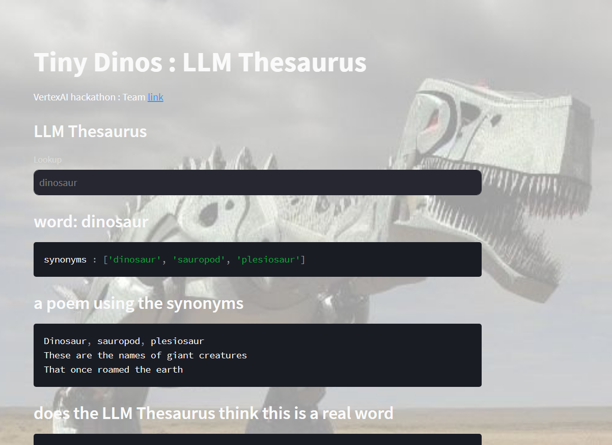

# Tiny Dinos

Tiny Dinos is a project that is a thesaurus app using [VertexAI](https://cloud.google.com/vertex-ai)
* More at: https://lablab.ai/event/google-vertex-ai-hackathon/tiny-dinos/tiny-dinos



## Installation
Use the package manager [pip](https://pip.pypa.io/en/stable/) 
```bash
pip install streamlit
pip install -r requirements.txt
```

## Example toml file
```toml
project=''
location='us-central1'
staging_bucket=''
[credentials]
    type=""
    project_id=""
    private_key_id=""
    private_key=""
    client_email=""
    client_id=""
    auth_uri="https://accounts.google.com/o/oauth2/auth"
    token_uri="https://oauth2.googleapis.com/token"
    auth_provider_x509_cert_url="https://www.googleapis.com/oauth2/v1/certs"
    client_x509_cert_url=""
    universe_domain="googleapis.com"
```

## Running locally (environment params)
```bash
export islocal=True
streamlit run streamlit-app.py
```
* Populate a ```../serviceAccount.toml``` with GCP configuration

## Running locally (manual)
* Set ```isLocal=True``` in streamlit-app.py
* Populate a ```../serviceAccount.toml``` with GCP configuration

## deployed to streamlit (manual)
* Set ```isLocal=False``` in streamlit-app.py
* Add in GCP configuration into streamlit 


## Images
Created with stable diffusion

